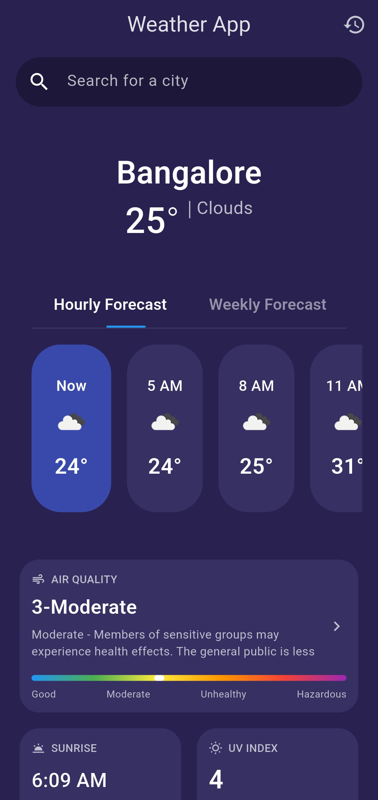
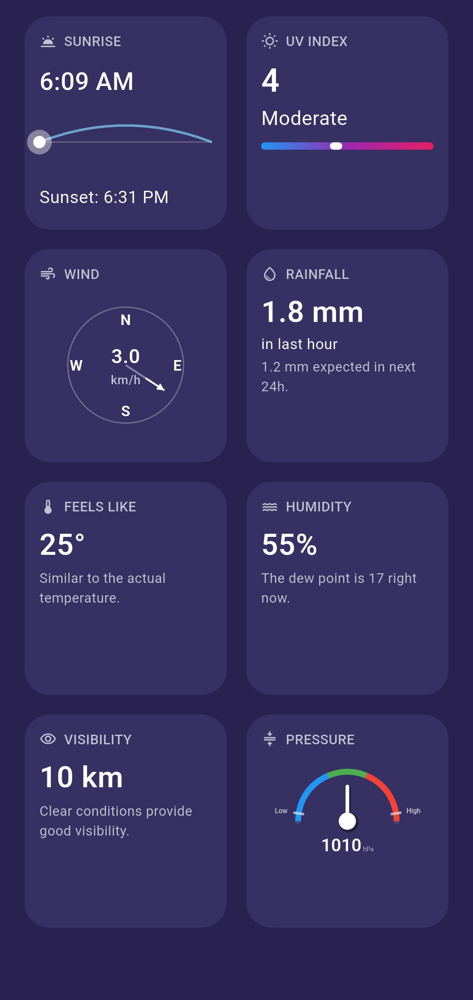
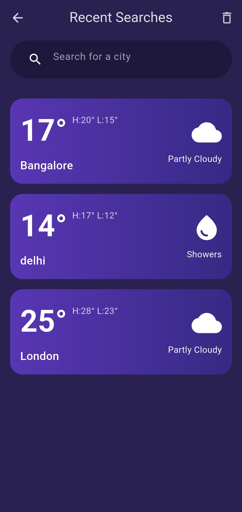
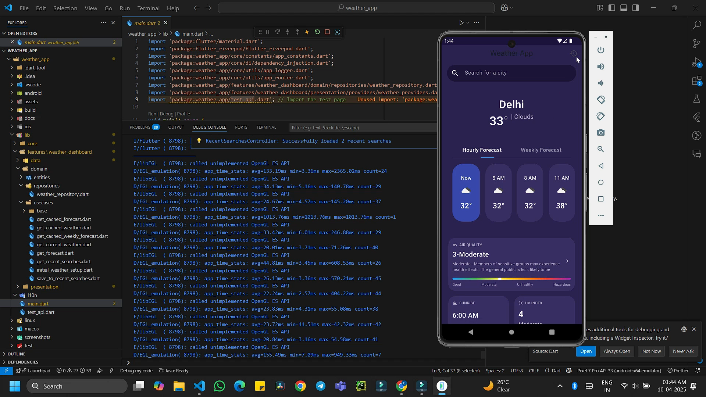

# Weather App

A modern Flutter weather application with a clean architecture, beautiful UI, and comprehensive features.

## Features

- Current weather conditions with detailed metrics
- 5-day weather forecast with hourly and daily views
- Recent search history
- Beautiful UI with responsive design
- Light and dark theme support
- Persistent data caching for offline access
- Comprehensive error handling

## Key Technical Implementations

### Clean Architecture
- Strict separation of concerns with data, domain, and presentation layers
- Repository pattern implementation for data access abstraction
- Use cases for encapsulating business logic
- Domain entities separate from data models

### Advanced State Management
- Riverpod for dependency injection and state management
- Reactive programming with StateNotifier and state immutability
- Proper loading, error, and success states for async operations
- Smart caching strategy with automatic refresh

### Robust Error Handling
- Custom error types with meaningful error messages
- Graceful fallback to cached data when network is unavailable
- User-friendly error presentations
- Comprehensive try-catch blocks with proper error propagation

### Comprehensive Logging
- Strategic logging throughout the application
- Different log levels (debug, info, warning, error)
- Detailed API call logging for debugging
- Performance tracking for critical operations

### Offline Support
- Persistent caching of weather data and forecasts
- Cache expiry management with time-based invalidation
- Automatic fallback to cached data when offline
- Visual indicators for cached vs. fresh data

### Code Quality
- Extensive inline documentation and code comments
- Consistent naming conventions and code structure
- Proper null safety implementation
- Modular and reusable components

### Screenshots

  <div style="display: flex; flex-wrap: nowrap; overflow-x: auto; gap: 20px; padding: 10px;">
    <div style="text-align: center; min-width: 300px;">
      
      <br>
      <em>Main dashboard with current weather and detailed metrics</em>
    </div>
    <div style="text-align: center; min-width: 300px;">
      
      <br>
      <em>Detailed forecast view with hourly and daily predictions</em>
    </div>
    <div style="text-align: center; min-width: 300px;">
      
      <br>
      <em>Comprehensive weather details with air quality and UV index</em>
    </div>
  </div>


## Demo Video

<p align="center">
  <a href="screenshots/demo_vid-1.mp4">
    
    <br>
    <em>Click to watch demo video</em>
  </a>
</p>

## Getting Started

### Prerequisites
- Flutter (Version 3.0.0 or higher)
- Dart (Version 2.17.0 or higher)
- API Key from [OpenWeatherMap](https://openweathermap.org/api)

### Installation
1. Clone this repository
2. Install dependencies (`flutter pub get`)
3. Configure your API key:
   - Open `lib/core/constants/api_keys.dart`
   - Replace `YOUR_API_KEY_HERE` with your OpenWeatherMap API key
4. Run the app (`flutter run`)

### Environment Variables (Optional)
This project supports environment variables through a `.env` file:
1. Copy `.env.example` to `.env`
2. Update the variables with your values:
   ```
   OPEN_WEATHER_MAP_API_KEY=your_api_key_here
   DEFAULT_CITY=Bangalore
   CACHE_DURATION_HOURS=1
   ```
3. Note: Direct configuration via `api_keys.dart` is still required for now

## Architecture

This app follows clean architecture principles with a clear separation of concerns:

- **Domain Layer**: Contains business logic, entities, and repository interfaces
- **Data Layer**: Handles data from remote API and local storage
- **Presentation Layer**: UI components using Riverpod for state management

## Data Layer Optimizations

The data layer has been optimized for maintainability, reusability, and error handling:

- Added **JsonParser** for consistent, type-safe JSON parsing and error handling
- Created **CacheService** for centralized cache management
- Implemented **ApiClient** for standardized API interactions
- Enhanced error handling with consistent patterns and graceful fallbacks

## Technologies Used

- **Flutter**: UI framework
- **Riverpod**: State management
- **http**: Network requests
- **shared_preferences**: Local storage
- **intl**: Formatting and localization
- **connectivity_plus**: Network connectivity detection

## Project Structure

The project follows the structure defined in `.cursorrules`:

```
lib/
  core/                 # Core utilities and constants
    constants/          # App-wide constants including API keys
    theme/              # App theme
    utils/              # Utilities
    widgets/            # Common widgets
  features/             # App features
    weather_dashboard/  # Weather feature
      data/             # Data layer
      domain/           # Domain layer
      presentation/     # Presentation layer
  l10n/                 # Localization
  main.dart             # App entry point
```

## Git Setup

This project is prepared for Git with:
- API keys excluded from version control
- Proper `.gitignore` configuration
- Project structure following `.cursorrules` guidelines

When contributing, ensure you:
1. Never commit `api_keys.dart` file or `.env` file
2. Follow the architecture defined in project_instruction.md
3. Adhere to the coding standards in `.cursorrules`

